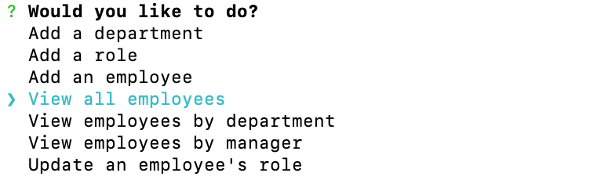
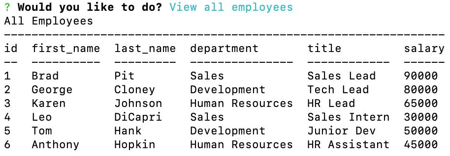

# Employee-Tracker
This is a CLI content management system to manage a company's employees. It allows the user to add department, role, and employee information to the database (MySQL).

## Images
#1:

#2:

